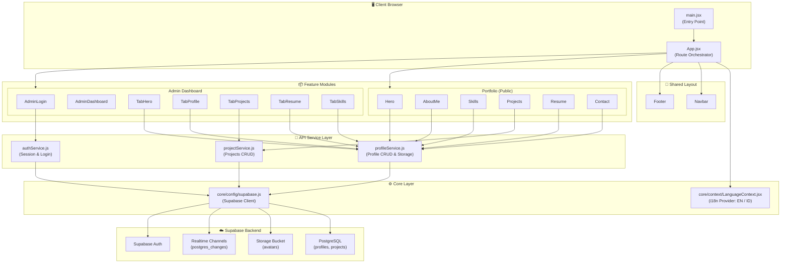

# 🌌 Professional Portfolio — Enterprise-Grade SPA

A high-performance, real-time single-page application (SPA) portfolio built with **React + Vite + Supabase**. Features a modular architecture with a clean separation of concerns: dedicated API service layers, domain-driven feature modules, and a centralized configuration core.

---

## 🏗️ System Architecture Diagram



---

## 📂 Folder Structure

```
src/
├── assets/                          # Static resources (images, icons)
│   └── photo.jpg
├── core/                            # Global configuration & shared contexts
│   ├── config/
│   │   └── supabase.js              # Supabase client singleton
│   └── context/
│       └── LanguageContext.jsx       # i18n context provider (EN / ID)
├── services/                        # Centralized API service layer
│   ├── authService.js               # Authentication (login, logout, session)
│   ├── profileService.js            # Profile CRUD, avatar upload, realtime
│   └── projectService.js            # Projects CRUD & realtime subscriptions
├── components/                      # Shared UI components
│   └── layout/
│       ├── Navbar.jsx               # Navigation bar with scroll spy
│       └── Footer.jsx               # Site footer
├── features/                        # Domain-specific feature modules
│   ├── portfolio/                   # Public-facing portfolio sections
│   │   ├── components/
│   │   │   ├── Hero.jsx             # Landing hero section
│   │   │   ├── AboutMe.jsx          # Profile & competency cards
│   │   │   ├── Skills.jsx           # Matrix cards & proficiency bars
│   │   │   ├── Projects.jsx         # Project showcase with pagination
│   │   │   ├── Resume.jsx           # Education & experience timeline
│   │   │   └── Contact.jsx          # Contact form (EmailJS + SweetAlert2)
│   │   └── index.js                 # Barrel exports
│   └── admin/                       # Admin dashboard module
│       ├── pages/
│       │   ├── AdminLogin.jsx       # Authentication gate
│       │   └── AdminDashboard.jsx   # Tab-based control panel
│       ├── components/
│       │   ├── TabHero.jsx          # Hero section editor
│       │   ├── TabProfile.jsx       # Profile & contact editor
│       │   ├── TabProjects.jsx      # Project CRUD with auto-translate
│       │   ├── TabResume.jsx        # Education & experience editor
│       │   └── TabSkills.jsx        # Matrix cards & proficiency editor
│       └── index.js                 # Barrel exports
├── App.jsx                          # Application orchestrator & routing
├── main.jsx                         # DOM mount point
└── index.css                        # Global Tailwind CSS imports
```

---

## 🛠️ Technology Stack

| Layer | Technology | Purpose |
|-------|-----------|---------|
| **Runtime** | React 18+ (Hooks, Context API) | Component-based UI |
| **Build Tool** | Vite | Lightning-fast HMR & bundling |
| **Styling** | Tailwind CSS 4 (Vite Plugin) | Utility-first design system |
| **Database** | Supabase (PostgreSQL) | Managed BaaS with Row Level Security |
| **Realtime** | Supabase Channels | Live data sync via `postgres_changes` |
| **Storage** | Supabase Storage | Avatar image bucket |
| **Auth** | Supabase Auth | Email/password authentication |
| **Email** | EmailJS (`@emailjs/browser`) | Contact form SMTP relay |
| **Notifications** | SweetAlert2 | Dark-themed confirmation dialogs |
| **i18n** | Custom Context API | English ↔ Indonesian toggle |

---

## 🚀 Getting Started

### Prerequisites

- **Node.js** ≥ 18.x
- **npm** ≥ 9.x
- A **Supabase** project with:
  - `profiles` table (id=1, with all JSONB columns)
  - `projects` table
  - `avatars` storage bucket (public)
  - Email/password auth enabled

### Installation

```bash
# 1. Clone the repository
git clone <repository-url>
cd porto

# 2. Install dependencies
npm install

# 3. Configure environment variables
#    Create a .env file in the project root:
cp .env.example .env
```

### Environment Variables

Create a `.env` file with the following keys:

```env
VITE_SUPABASE_URL=https://your-project.supabase.co
VITE_SUPABASE_ANON_KEY=your-anon-key-here
```

### Development Server

```bash
npm run dev
```

The app will be available at `http://localhost:5173`.

### Production Build

```bash
npm run build
npm run preview   # Preview the production build locally
```

---

## 🔐 Admin Portal

The admin dashboard is accessed via hash-based routing:

```
http://localhost:5173/#admin-portal
```

Login with your Supabase Auth credentials. The dashboard provides tabbed management for:

- **Hero Section** — Greeting text, headline, description (EN/ID)
- **Profile & Metadata** — Identity, avatar, summaries, contact info, competency cards
- **Projects** — Full CRUD with auto-translation (EN→ID)
- **Skills & Resume** — Matrix cards, proficiency bars, education, experience

All changes sync in real-time across open browser tabs.

---

## 📐 Architecture Principles

1. **Separation of Concerns (SoC)** — Database operations are isolated in `services/`, presentation logic lives in `features/`, and global configs reside in `core/`.
2. **Domain-Driven Modules** — Features are grouped by business domain (`portfolio`, `admin`) rather than technical type.
3. **Centralized Service Layer** — No component imports `supabase` directly. All database interactions flow through typed service functions.
4. **Barrel Exports** — Each feature module exposes a clean `index.js` for simplified imports.
5. **Real-time First** — Every data-fetching component subscribes to Supabase Channels for live updates.

---

## 📄 License

© 2025 All Rights Reserved.
